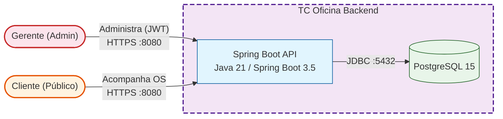
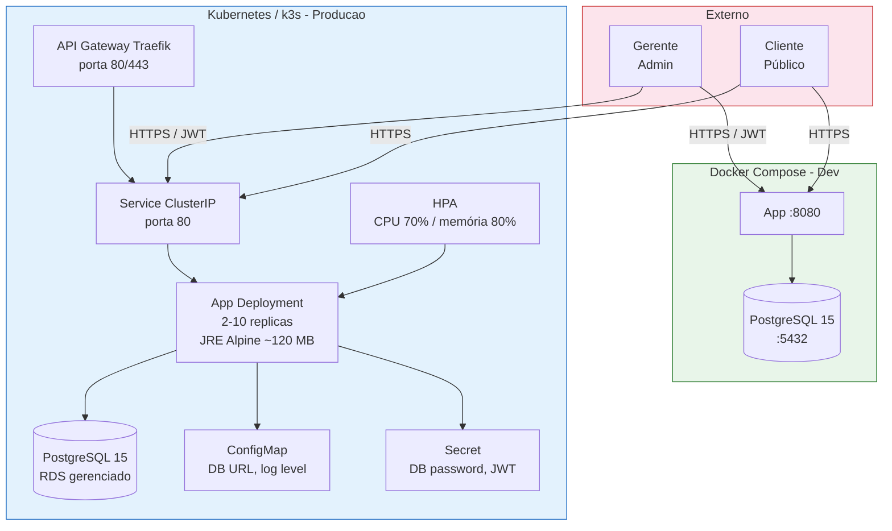
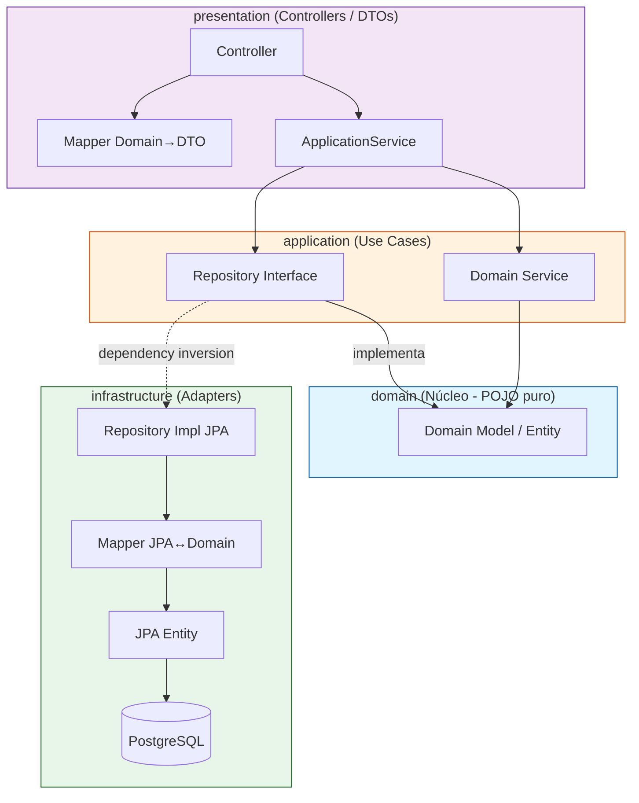
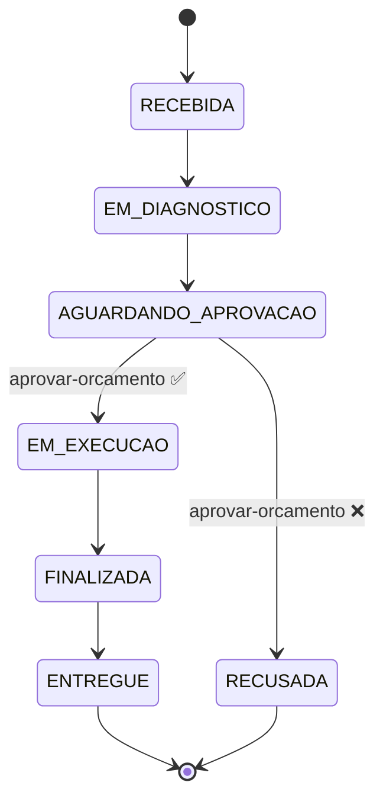

# Tech Challenge - Oficina Mecânica Backend

[](LICENSE)


---

## Sumário Executivo

Backend robusto para gestão de oficina mecânica com:
- **Clean Architecture** - Código organizado em camadas independentes (domain, application, infrastructure, presentation)
- **Event Sourcing & Domain Storytelling** - Rastreamento de eventos de negócio
- **RESTful API** completa com autenticação JWT
- **Cobertura de testes**: 90% instruções (JaCoCo), 400+ testes
- **Production-ready**: Docker, Kubernetes, Terraform (AWS EKS), GitHub Actions CI/CD
- **Zero CVEs**: Todas as dependências auditadas
- **API Documentation**: Swagger/OpenAPI interativo

### Quick Start

```bash
# Com Docker (recomendado)
docker-compose up --build

# Acessar
curl http://localhost:8080/swagger-ui.html
curl -X GET http://localhost:8080/actuator/health
```

---

## Tabela de Conteúdos

1. [Funcionalidades](#funcionalidades)
2. [Tecnologias](#tecnologias)
3. [Arquitetura](#arquitetura)
4. [Como Executar](#como-executar)
5. [API Endpoints](#endpoints-da-api)
6. [Configuração](#configuração-de-variáveis-de-ambiente)
7. [Testes & Qualidade](#testes--qualidade)
8. [Deployment](#deployment)
9. [Observabilidade](#observabilidade)
10. [Troubleshooting](#troubleshooting)
11. [Contribuindo](#contribuindo)

---

## Funcionalidades

- **CRUD de Clientes** - Cadastro com validação de CPF/CNPJ
- **CRUD de Veículos** - Associação com cliente e validação de placa (ABC1234 / ABC1D23)
- **CRUD de Serviços** - Gestão de serviços e preços
- **CRUD de Peças** - Inventário com margem de lucro configurável
- **Ordens de Serviço (OS)** - Gestão completa com fluxo de status automático:

  `RECEBIDA → EM_DIAGNOSTICO → AGUARDANDO_APROVACAO → EM_EXECUCAO → FINALIZADA → ENTREGUE`

  E também recusa: `AGUARDANDO_APROVACAO → RECUSADA`

- **Cálculo Automático** de orçamento (serviços + peças com margem de lucro)
- **Aprovação de Orçamento** pelo cliente (via endpoint público)
- **Acompanhamento Público** - Clientes podem consultar suas OS sem autenticação
- **Autenticação JWT** - Endpoints administrativos protegidos
- **Métricas de Negócio** - Tempo médio de execução por serviço
- **Documentação Swagger/OpenAPI** - Exploração interativa da API

---

## Tecnologias

### Core

| Tecnologia | Versão | Justificativa |
|-----------|--------|--------------|
| **Java** | 21 | Latest LTS, performance e features modernas |
| **Spring Boot** | 3.5.13 | Framework consolidado com excelente ecossistema |
| **Spring Data JPA** | - | ORM simplificado e integrado |
| **Spring Security** | - | Autenticação e autorização robustas |
| **PostgreSQL** | 15 | ACID compliance, extensões avançadas, open source |
| **JWT (jjwt)** | 0.12.6 | Autenticação stateless segura |

### Qualidade & Testes

- **JUnit 5** - Framework de testes moderno
- **Mockito** - Mocking para testes unitários
- **JaCoCo** - Cobertura de testes (90% instruções)
- **TestContainers** - Testes de integração com PostgreSQL em container

### DevOps & Deployment

- **Docker & Docker Compose** - Containerização multi-stage (~120 MB)
- **Kubernetes (EKS)** - Orquestração na AWS
- **Terraform** - Infrastructure as Code (recursos K8s via AWS EKS)
- **GitHub Actions** - CI/CD pipeline automatizado
- **Maven** - Build tool

### Documentação

- **Swagger/OpenAPI 3** - Documentação interativa de APIs via Springdoc

---

## Arquitetura

### Visão Geral (C4-style)



### Visão Geral de Deployment



**Ambientes:**

| Ambiente | Stack | Uso |
|----------|-------|-----|
| **Docker Compose** | App + PostgreSQL 15 | Desenvolvimento local |
| **Kubernetes (EKS)** | App (2-10 pods), PostgreSQL, ConfigMap, Secret, HPA | Produção / staging |
| **Terraform** | Provisiona namespace, deployment, service, configmap, secret | IaC sobre EKS |

### Clean Architecture

O projeto segue **Clean Architecture** com separação rigorosa de responsabilidades:


### Fluxo de uma Requisição HTTP

```
1. HTTP Request  →  Controller  (@RestController)
2. Controller    →  ApplicationService  (@Service, @Transactional)
3. Service       →  Domain Repository Interface  (interface pura)
4. Repository Impl  →  Mapper (Domain → JPA Entity)
5. JPA Repo      →  Banco de Dados
   ↓
6. JPA Repo      →  Mapper (JPA Entity → Domain)
7. Repository Impl  →  Domain Object de volta
8. Service       →  Mapper (Domain → DTO)
9. Controller    →  HTTP Response
```

### Fluxo de Status da Ordem de Serviço



### Domain Storytelling

#### Fluxo 1: Cadastro de Cliente e Veículo

```
1. [Cliente] solicita serviço
2. [Gerente] acessa /api/v1/admin/clientes e cria novo cliente
   - Valida CPF/CNPJ (com dígito verificador)
   - Armazena informações de contato
3. [Gerente] acessa /api/v1/admin/veiculos e associa veículo ao cliente
   - Valida placa (padrão antigo ABC1234 ou Mercosul ABC1D23)
   - Registra marca, modelo, ano
```

**Entidades**: `Cliente` (CPF/CNPJ), `Veiculo` (Placa)

#### Fluxo 2: Criação e Orçamento de Ordem de Serviço

```
1. [Gerente] cria ordem via POST /api/v1/admin/ordem
2. Sistema calcula orçamento automaticamente
   - Σ(servicos) + Σ(peças com margem)
3. [Cliente] aprova via POST /ordem/{id}/aprovar-orcamento
   - Se aprovado → status EM_EXECUCAO
   - Se recusado → status RECUSADA
4. Status avança conforme execução
   - EM_EXECUCAO → FINALIZADA → ENTREGUE
```

**Domain Services**: `CalculoOrcamentoService`, `OrdemServicoDomainService`

#### Fluxo 3: Acompanhamento Público (Cliente)

```
1. [Cliente] acessa GET /api/v1/publico/ordem/cliente/{clienteId}
2. Sistema retorna suas OS com status atual, orçamento e datas
```

---

## Estrutura do Projeto

```
tc-oficina-app/
├── .github/workflows/
│   └── ci.yml                  # CI/CD: build, testes, Docker build, deploy
├── src/
│   ├── main/
│   │   ├── java/br/com/fiap/
│   │   │   ├── domain/
│   │   │   │   ├── model/          # Entidades de negócio (POJO)
│   │   │   │   ├── service/        # Lógica de negócio pura
│   │   │   │   └── repository/     # Interfaces de repositório
│   │   │   ├── application/
│   │   │   │   └── service/        # Casos de uso (@Service)
│   │   │   ├── infrastructure/
│   │   │   │   ├── repository/     # Implementações com Spring Data
│   │   │   │   ├── persistence/
│   │   │   │   │   ├── entity/     # JPA Entities
│   │   │   │   │   └── mapper/     # Conversores JPA↔Domain
│   │   │   │   └── config/         # Security, JWT, CORS, Beans
│   │   │   ├── presentation/
│   │   │   │   ├── controller/     # @RestController
│   │   │   │   ├── dto/            # Request/Response records
│   │   │   │   ├── mapper/         # Domain → DTO converters
│   │   │   │   └── exception/      # @ControllerAdvice
│   │   │   └── TcOficinaApplication.java
│   │   └── resources/
│   │       └── application.properties
│   └── test/
│       └── java/br/com/fiap/      # 400+ testes unitários + integração
├── Dockerfile                  # Multi-stage build JDK 21 → JRE Alpine
├── docker-compose.yml          # App + PostgreSQL 15 com health checks
├── pom.xml                     # Dependências Maven (versão centralizada)
├── LICENSE                     # MIT License
└── README.md                   # Este arquivo
```

> **Repositórios relacionados:**
> - [tc-oficina-infra-k8s](https://github.com/rtmaraujo/tc-oficina-infra-k8s) - Cluster k3s (EC2) + manifestos Kubernetes (Terraform)
> - [tc-oficina-infra-db](https://github.com/rtmaraujo/tc-oficina-infra-db) - RDS PostgreSQL gerenciado (Terraform)
> - [tc-oficina-lambda](https://github.com/rtmaraujo/tc-oficina-lambda) - Function Serverless de autenticação via CPF (Lambda + API Gateway)

---

## Como Executar

### Pré-requisitos

- **Docker & Docker Compose** instalados (ou Java 21 + Maven + PostgreSQL)
- **Port 8080** disponível para aplicação
- **Port 5432** disponível para PostgreSQL

### Opção 1: Com Docker Compose (Recomendado)

1. **Clone e configure:**

```bash
git clone https://github.com/seu-usuario/tc-oficina-app.git
cd tc-oficina
cp .env.example .env
```

2. **Ajuste variáveis em `.env` se necessário:**

```dotenv
POSTGRES_DB=oficina_db
POSTGRES_USER=oficina_user
POSTGRES_PASSWORD=oficina_pass
JWT_SECRET=meu_secret_jwt_super_seguro_12345
ADMIN_USUARIO=admin
ADMIN_SENHA=admin123
```

3. **Inicie os serviços:**

```bash
docker-compose up --build
```

4. **Verifique a saúde da aplicação:**

```bash
curl -s http://localhost:8080/actuator/health | jq
```

5. **Acesse Swagger:**

- API Docs: http://localhost:8080/swagger-ui.html
- OpenAPI JSON: http://localhost:8080/v3/api-docs

### Opção 2: Localmente sem Docker

**Pré-requisitos:** Java 21+, Maven 3.8+, PostgreSQL 15+

1. **Configure PostgreSQL:**

```sql
CREATE DATABASE oficina_db;
CREATE USER oficina_user WITH PASSWORD 'oficina_pass';
ALTER ROLE oficina_user SET client_encoding TO 'utf8';
GRANT ALL PRIVILEGES ON DATABASE oficina_db TO oficina_user;
```

2. **Configure variáveis de ambiente:**

```bash
export SPRING_DATASOURCE_URL=jdbc:postgresql://localhost:5432/oficina_db
export SPRING_DATASOURCE_USERNAME=oficina_user
export SPRING_DATASOURCE_PASSWORD=oficina_pass
export JWT_SECRET=seu_secret_jwt_aqui
export ADMIN_USUARIO=admin
export ADMIN_SENHA=admin123
```

3. **Compile e execute:**

```bash
mvn clean package -DskipTests
java -jar target/*.jar
```

A aplicação estará disponível em `http://localhost:8080`

> **Dica:** O arquivo `requests.http` na raiz do projeto contém exemplos prontos de todas as requisições (autenticação, CRUD de clientes, veículos, serviços, peças e ordens de serviço). Use com IntelliJ IDEA ou VS Code REST Client para testar a API rapidamente.

---

## Endpoints da API

### 1. Autenticação (Público)

| Método | Endpoint | Descrição | Body |
|--------|----------|-----------|------|
| `POST` | `/api/v1/auth/login` | Obter token JWT | `{"usuario":"admin","senha":"admin123"}` |

**Response (200):**
```json
{
  "access_token": "eyJhbGciOiJIUzI1NiJ9...",
  "token_type": "Bearer",
  "expires_in": 86400
}
```

---

### 2. Clientes (Admin - Requer JWT)

| Método | Endpoint | Descrição |
|--------|----------|-----------|
| `POST` | `/api/v1/admin/clientes` | Criar cliente |
| `GET` | `/api/v1/admin/clientes/{id}` | Obter cliente por ID |
| `PUT` | `/api/v1/admin/clientes/{id}` | Atualizar cliente |
| `DELETE` | `/api/v1/admin/clientes/{id}` | Deletar cliente |

**Exemplo de POST:**
```json
{
  "nome": "João Silva",
  "cpfCnpj": "123.456.789-00",
  "email": "joao@email.com",
  "telefone": "(11) 98765-4321"
}
```

---

### 3. Veículos (Admin)

| Método | Endpoint | Descrição |
|--------|----------|-----------|
| `POST` | `/api/v1/admin/veiculos` | Criar veículo |
| `GET` | `/api/v1/admin/veiculos/{id}` | Obter veículo |
| `GET` | `/api/v1/admin/veiculos/cliente/{clienteId}` | Listar por cliente |
| `PUT` | `/api/v1/admin/veiculos/{id}` | Atualizar veículo |
| `DELETE` | `/api/v1/admin/veiculos/{id}` | Deletar veículo |

**Exemplo POST:**
```json
{
  "clienteId": 1,
  "placa": "ABC1D23",
  "marca": "Toyota",
  "modelo": "Corolla",
  "ano": 2022
}
```

---

### 4. Serviços (Admin)

| Método | Endpoint | Descrição |
|--------|----------|-----------|
| `POST` | `/api/v1/admin/servicos` | Criar serviço |
| `GET` | `/api/v1/admin/servicos/{id}` | Obter serviço |
| `PUT` | `/api/v1/admin/servicos/{id}` | Atualizar serviço |
| `DELETE` | `/api/v1/admin/servicos/{id}` | Deletar serviço |

**Exemplo POST:**
```json
{
  "nome": "Alinhamento",
  "descricao": "Alinhamento de direção",
  "valor": 150.00
}
```

---

### 5. Peças (Admin)

| Método | Endpoint | Descrição |
|--------|----------|-----------|
| `POST` | `/api/v1/admin/pecas` | Criar peça |
| `GET` | `/api/v1/admin/pecas/{id}` | Obter peça |
| `PUT` | `/api/v1/admin/pecas/{id}` | Atualizar peça |
| `DELETE` | `/api/v1/admin/pecas/{id}` | Deletar peça |

**Exemplo POST:**
```json
{
  "nome": "Filtro de Óleo",
  "descricao": "Filtro de óleo genuíno",
  "valorCusto": 25.00,
  "margemLucro": 0.40
}
```

---

### 6. Ordens de Serviço (Admin)

| Método | Endpoint | Descrição | Query Params |
|--------|----------|-----------|--------------|
| `POST` | `/api/v1/admin/ordem` | Criar ordem | - |
| `GET` | `/api/v1/admin/ordem` | Listar ordens | `?status=RECEBIDA&page=0&size=10` |
| `GET` | `/api/v1/admin/ordem/{id}` | Obter ordem | - |
| `PUT` | `/api/v1/admin/ordem/{id}/avanca` | Avançar status | - |
| `POST` | `/api/v1/admin/ordem/{id}/aprovar-orcamento` | Aprovar/recusar orçamento | - |
| `DELETE` | `/api/v1/admin/ordem/{id}` | Deletar ordem | - |

**POST /api/v1/admin/ordem:**
```json
{
  "clienteCpfCnpj": "123.456.789-00",
  "placaVeiculo": "ABC1D23",
  "servicosIds": [1, 2],
  "pecasIds": [1, 3]
}
```

**Response (201) - OrdemServicoDTO:**
```json
{
  "id": 1,
  "clienteId": 1,
  "clienteNome": "João Silva",
  "veiculoId": 1,
  "veiculoPlaca": "ABC1D23",
  "status": "RECEBIDA",
  "criadoEm": "2026-07-02T10:30:00",
  "finalizadoEm": null,
  "servicos": [
    { "id": 1, "nome": "Alinhamento", "valor": 150.00 }
  ],
  "pecas": [
    { "id": 1, "nome": "Filtro de Óleo", "quantidade": 1, "valor": 35.00 }
  ],
  "totalOrcamento": 185.00
}
```

**PUT /api/v1/admin/ordem/{id}/avanca:**
```
Body vazio — apenas avança o status para o próximo estado
```

**POST /api/v1/admin/ordem/{id}/aprovar-orcamento:**
```json
{
  "aprovado": true,
  "observacoes": "Orçamento aprovado pelo cliente"
}
```

---

### 7. Métricas de Negócio (Admin)

| Método | Endpoint | Descrição |
|--------|----------|-----------|
| `GET` | `/api/v1/admin/metricas/tempo-execucao` | Tempo médio por serviço |

**Response:**
```json
[
  {
    "servicoNome": "Alinhamento",
    "tempoMedioMinutos": 45,
    "quantidadeExecucoes": 12
  }
]
```

---

### 8. Acompanhamento Público (Cliente — sem autenticação)

| Método | Endpoint | Descrição |
|--------|----------|-----------|
| `GET` | `/api/v1/publico/ordem/cliente/{clienteId}` | Listar OS do cliente |
| `POST` | `/api/v1/publico/ordem/{id}/aprovar-orcamento` | Aprovar ou recusar orçamento |

**Aprovação de Orçamento:**

```bash
curl -X POST http://localhost:8080/api/v1/publico/ordem/1/aprovar-orcamento \
  -H "Content-Type: application/json" \
  -d '{
    "aprovado": true,
    "observacoes": "Aprovado, pode prosseguir"
  }'
```

**Recusa:**
```bash
curl -X POST http://localhost:8080/api/v1/publico/ordem/1/aprovar-orcamento \
  -H "Content-Type: application/json" \
  -d '{
    "aprovado": false,
    "observacoes": "Orçamento acima do esperado"
  }'
```

**Response (OrdemServicoStatusDTO):**
```json
{
  "id": 1,
  "status": "EM_EXECUCAO",
  "orcamento": 185.00,
  "ultimaAtualizacao": "2026-07-02T11:00:00"
}
```

**Status codes:**
- `200` - Orçamento aprovado/recusado com sucesso
- `400` - Ordem não está em `AGUARDANDO_APROVACAO`
- `404` - Ordem não encontrada

---

### Health Check & Actuator (Público)

| Método | Endpoint | Descrição |
|--------|----------|-----------|
| `GET` | `/actuator/health` | Status da aplicação |
| `GET` | `/actuator/health/liveness` | Liveness probe (K8s) |
| `GET` | `/actuator/health/readiness` | Readiness probe (K8s) |

---

## Configuração de Variáveis de Ambiente

### Desenvolvimento (Docker)

Configure em `.env` na raiz do projeto:

```dotenv
# Database
POSTGRES_DB=oficina_db
POSTGRES_USER=oficina_user
POSTGRES_PASSWORD=oficina_pass
SPRING_DATASOURCE_URL=jdbc:postgresql://db:5432/oficina_db
SPRING_DATASOURCE_USERNAME=oficina_user
SPRING_DATASOURCE_PASSWORD=oficina_pass

# JWT Secret
JWT_SECRET=mySecretKeyForJwtTokenGenerationThatIsLongEnough

# Admin Credentials
ADMIN_USUARIO=admin
ADMIN_SENHA=admin123

# CORS (opcional, default http://localhost:3000)
CORS_ALLOWED_ORIGINS=http://localhost:3000

# Docker Build
BUILD_DATE=$(date -u +'%Y-%m-%dT%H:%M:%SZ')
COMMIT_SHA=unknown
```

### Produção

**NUNCA commitar `.env` com credenciais reais!**

Em produção, use variáveis de ambiente do sistema ou secrets manager:

```bash
# AWS Secrets Manager / Parameter Store
# Kubernetes Secrets
# HashiCorp Vault
```

```bash
export SPRING_DATASOURCE_URL=jdbc:postgresql://prod-db:5432/oficina
export SPRING_DATASOURCE_USERNAME=prod_user
export SPRING_DATASOURCE_PASSWORD=<gerado_vault>
export JWT_SECRET=<gerado_cryptographically>
```

---

## Testes & Qualidade

### Executar Testes

```bash
# Todos os testes
mvn test

# Com relatório JaCoCo
mvn test jacoco:report

# Visualizar relatório (Windows)
start target\site\jacoco\index.html

# Visualizar relatório (Linux/Mac)
open target/site/jacoco/index.html
```

### Métricas Atuais

| Métrica | Valor |
|---------|-------|
| **Testes** | 400+ (JUnit 5) |
| **Cobertura (Instruções)** | 90% (JaCoCo 0.8.11) |
| **Cobertura (Branch)** | 72% |
| **Java** | 21 source/target |
| **Build** | Maven |

### Exclusões de Cobertura (JaCoCo)

Configuradas em `pom.xml` para evitar ruído:
- `**/config/*` - Configurações do Spring
- `**/entity/*` - Mapeamentos JPA
- `**/request/*`, `**/response/*` - DTOs simples
- `**/*Application.class` - Entry point
- `**/*GlobalExceptionHandler.class` - Exception handling

### CVE Scan

**Zero vulnerabilidades encontradas**

Todas as dependências auditadas:
- Spring Boot 3.5.13
- Spring Security / Spring Data JPA
- PostgreSQL Driver 42.x
- JWT jjwt 0.12.6
- Swagger/OpenAPI (Springdoc)

Veja `relatorio_vulnerabilidade.md` para detalhes completos.

---

## Deployment

### Docker

#### Imagem Multi-Stage

O `Dockerfile` utiliza build multi-stage para otimizar tamanho:

| Stage | Base | Final |
|-------|------|-------|
| Builder | eclipse-temurin:21-jdk | Compila com Maven |
| Runtime | eclipse-temurin:21-jre-alpine | ~120 MB, usuário non-root |

```bash
# Construir imagem
docker build -t tc-oficina-app:latest .

# Executar localmente
docker run -p 8080:8080 \
  -e SPRING_DATASOURCE_URL=jdbc:postgresql://host.docker.internal:5432/oficina_db \
  tc-oficina-app:latest

# Executar com docker-compose (recomendado)
docker-compose up --build
docker-compose down      # Para parar
docker-compose down -v   # Para remover volumes
```

#### docker-compose.yml

```yaml
services:
  db:
    image: postgres:15-alpine
    volumes: [postgres_data:/var/lib/postgresql/data]
    healthcheck: { test: ["CMD-SHELL", "pg_isready ..."] }

  app:
    build: .
    ports: ["8080:8080"]
    depends_on: { db: { condition: service_healthy } }
    environment:
      SPRING_DATASOURCE_URL: jdbc:postgresql://db:5432/oficina_db
```

---

### Kubernetes (k3s em EC2) + Banco Gerenciado

O cluster Kubernetes (**k3s autogerenciado em EC2**), o banco de dados gerenciado (RDS)
e a function serverless de autenticação foram segregados em repositórios próprios:

| Recurso | Repositório |
|---------|-------------|
| Cluster k3s (EC2) + manifestos da app | [tc-oficina-infra-k8s](https://github.com/rtmaraujo/tc-oficina-infra-k8s) |
| RDS PostgreSQL (gerenciado) | [tc-oficina-infra-db](https://github.com/rtmaraujo/tc-oficina-infra-db) |
| Function Serverless de autenticação | [tc-oficina-lambda](https://github.com/rtmaraujo/tc-oficina-lambda) |

A imagem Docker gerada por este repositório é publicada no **ECR** e consumida pelo
`Deployment` no cluster k3s (NodePort).

**Ambientes em produção:**

| Ambiente | Namespace | API Gateway | Swagger | Auth |
|----------|-----------|-------------|---------|------|
| Produção | `tc-oficina` | `http://35.84.122.229` (porta 80) | `http://35.84.122.229/swagger-ui/index.html` | `http://35.84.122.229/auth` |
| Homologação | `tc-oficina-homolog` | `http://35.84.122.229:8081` | `http://35.84.122.229:8081/swagger-ui/index.html` | `http://35.84.122.229:8081/auth` |

Documentação de arquitetura, decisões (ADRs) e modelo de dados:
[`docs/architecture.md`](docs/architecture.md), [`docs/adr/`](docs/adr/),
[`docs/database-er.md`](docs/database-er.md).

---

### CI/CD (GitHub Actions)

Workflow em `.github/workflows/ci.yml`:

| Workflow | Arquivo | Trigger | Ações |
|----------|---------|---------|-------|
| **CI/CD** | `ci.yml` | Push/PR `main` | Maven build, testes, JaCoCo, Docker build |

#### Pipeline CI/CD

```
1. Checkout code
2. Setup Java 21 + Maven
3. mvn clean verify (compile + 400+ testes)
4. Upload JaCoCo artifacts
5. Build Docker image (multi-stage)
6. Simular deploy no Kubernetes
```

#### Secrets Necessários

Configure em GitHub > Settings > Secrets and variables > Actions:

| Secret | Exemplo | Uso |
|--------|---------|-----|
| `AWS_ACCOUNT_ID` | `123456789012` | ECR URI |
| `AWS_REGION` | `us-east-1` | AWS CLI region |
| `AWS_ROLE_ARN` | `arn:aws:iam::...:role/github-oidc` | OIDC federation |
| `DB_PASSWORD` | `<generated>` | RDS password |

---

## Observabilidade

### Health Checks

```bash
# Aplicação
curl http://localhost:8080/actuator/health
# {"status":"UP","components":{...}}

# Liveness Probe (reinicia se DOWN)
curl http://localhost:8080/actuator/health/liveness

# Readiness Probe (tráfego se UP)
curl http://localhost:8080/actuator/health/readiness
```

### Métricas (Prometheus)

Endpoints de métricas:
- `/actuator/metrics` - Lista todas as métricas
- `/actuator/metrics/{name}` - Detalhe de métrica

**Métricas importantes:**
- `jvm.memory.usage` - Uso de memória JVM
- `process.cpu.usage` - CPU da aplicação
- `http.server.requests` - Requisições HTTP
- `spring.data.repository.invocations` - Chamadas ao repositório

### Logs

```bash
# Docker Compose
docker-compose logs -f app

# Kubernetes
kubectl logs -f pod/app-deployment-xxx -n tc-oficina

# Log level dinâmico
export LOGGING_LEVEL_BR_COM_FIAP=DEBUG
```

### SonarQube

```bash
mvn clean verify sonar:sonar \
  -Dsonar.projectKey=tc-oficina \
  -Dsonar.host.url=https://sonarqube.example.com \
  -Dsonar.login=<token>
```

---

## Troubleshooting

### Erro: "Connection refused" PostgreSQL

```
ERROR: java.sql.SQLException: Connection refused
```

**Soluções:**
1. Verifique se PostgreSQL está rodando:
   ```bash
   docker ps | grep postgres  # Docker
   psql -U postgres           # Local
   ```

2. Se usando Docker Compose:
   ```bash
   docker-compose ps
   docker-compose logs db
   ```

3. Reinicie os containers:
   ```bash
   docker-compose down && docker-compose up --build
   ```

---

### Erro: "Port 8080 already in use"

```
ERROR: bind: address already in use [::]:8080
```

**Soluções:**
1. Encontre o processo:
   ```bash
   netstat -ano | findstr :8080    # Windows
   lsof -i :8080                   # Linux/Mac
   ```

2. Mude a porta:
   ```yaml
   # docker-compose.yml
   ports:
     - "8081:8080"
   ```

3. Mate o processo (cuidado!):
   ```bash
   taskkill /PID <pid> /F          # Windows
   kill -9 <pid>                   # Linux
   ```

---

### Erro: "JWT Token is expired or invalid"

```
ERROR: 401 Unauthorized - JWT token expired or invalid
```

**Soluções:**
1. Obtenha novo token:
   ```bash
   curl -X POST http://localhost:8080/api/v1/auth/login \
     -H "Content-Type: application/json" \
     -d '{"usuario":"admin","senha":"admin123"}'
   ```

2. Valide o formato do header:
   ```bash
   Authorization: Bearer <token>  # Correto
   Authorization: <token>         # Errado
   ```

3. Confirme a secret em `application.properties`:
   ```bash
   jwt.secret=${JWT_SECRET:default}
   ```

---

### Erro: "Invalid CPF/CNPJ format"

```
ERROR: 422 Unprocessable Entity - CPF/CNPJ format inválido
```

**Soluções:**
1. Use formato com máscara:
   ```
   CPF: 123.456.789-00    OK
   CNPJ: 12.345.678/0001-90  OK
   ```

2. O sistema valida dígito verificador automaticamente

---

### Erro: "Veiculo ou Cliente não encontrado"

```
ERROR: 404 Not Found - Resource not found
```

**Soluções:**
1. Liste recursos existentes:
   ```bash
   curl -H "Authorization: Bearer <token>" \
     http://localhost:8080/api/v1/admin/clientes
   ```

2. Confirme IDs corretos:
   ```bash
   GET /api/v1/admin/clientes    # Listar
   GET /api/v1/admin/clientes/1  # Obter específico
   ```

3. Crie recursos antes de referenciar:
   ```
   Ordem: Cliente → Veículo → Serviço/Peça → Ordem de Serviço
   ```

---

### Erro: "Ordem não está em AGUARDANDO_APROVACAO"

```
ERROR: 400 Bad Request - Ordem não está em AGUARDANDO_APROVACAO
```

**Solução:** O orçamento só pode ser aprovado/recusado quando a OS está no status `AGUARDANDO_APROVACAO`. Avance a OS até este status antes de chamar o endpoint de aprovação.

---

### Aplicação iniciando mas sem conectar ao banco

```
WARN: Could not connect to database, retrying...
```

**Soluções:**
1. Verifique `application.properties` ou variáveis de ambiente

2. Se Docker: confirme que ambos containers estão na mesma rede:
   ```bash
   docker network ls
    docker network inspect tc-oficina_oficina-network
   ```

3. Aguarde health check passar:
   ```bash
   docker-compose logs app
   ```

---

### Swagger não carrega

```
HTTP 404 em /swagger-ui.html
```

**Soluções:**
1. Confirme dependência no `pom.xml`:
   ```xml
   <dependency>
     <groupId>org.springdoc</groupId>
     <artifactId>springdoc-openapi-starter-webmvc-ui</artifactId>
   </dependency>
   ```

2. Verifique se aplicação está rodando:
   ```bash
   curl http://localhost:8080/actuator/health
   ```

3. Tente acessar diretamente via JSON:
   ```bash
   curl http://localhost:8080/v3/api-docs
   ```

---

## Testes de Segurança

### Validar Proteção de Rotas

#### 1. Sem Token (deve retornar 401)

```bash
curl -s -w "\nStatus: %{http_code}\n" \
  -X GET http://localhost:8080/api/v1/admin/clientes
```

**Esperado:**
```
Status: 401
```

#### 2. Com Token Inválido (deve retornar 401)

```bash
curl -s -w "\nStatus: %{http_code}\n" \
  -X GET http://localhost:8080/api/v1/admin/clientes \
  -H "Authorization: Bearer invalid_token_123"
```

#### 3. Com Token Válido (deve retornar 200)

```bash
# Obter token
TOKEN=$(curl -s -X POST http://localhost:8080/api/v1/auth/login \
  -H "Content-Type: application/json" \
  -d '{"usuario":"admin","senha":"admin123"}' \
  | grep -o '"access_token":"[^"]*' | cut -d'"' -f4)

# Usar token
curl -s -w "\nStatus: %{http_code}\n" \
  -X GET http://localhost:8080/api/v1/admin/clientes \
  -H "Authorization: Bearer $TOKEN" | head -20
```

**Esperado:**
```json
{"content":[],"pageable":{...}}
Status: 200
```

#### 4. Rotas Públicas sem Token (devem retornar 200)

```bash
curl -s -w "\nStatus: %{http_code}\n" \
  -X GET http://localhost:8080/actuator/health

curl -s -w "\nStatus: %{http_code}\n" \
  -I http://localhost:8080/swagger-ui.html
```

---

## Contribuindo

### Fluxo de Contribuição

1. **Fork** o repositório
2. **Clone** seu fork
3. **Crie branch** para sua feature: `git checkout -b feature/sua-feature`
4. **Commit** mudanças
5. **Push** para fork
6. **Abra Pull Request**

### Padrões de Código

- **Clean Architecture**: Respeite as camadas
- **SOLID**: Aplique princípios SOLID
- **Tests**: Mínimo 80% de cobertura
- **Commits**: Use conventional commits (`feat:`, `fix:`, `docs:`)
- **Branches**: Use nomenclatura clara (`feature/nova-funcionalidade`, `bugfix/corrigir-bug`)

### Relatórios & Documentação

- **Vulnerabilidades**: Veja `relatorio_vulnerabilidade.md`
- **Diagramas**: Documentados em Mermaid neste README

---

## Referências

- [Spring Boot 3.5 Docs](https://spring.io/projects/spring-boot)
- [Clean Architecture](https://blog.cleancoder.com/uncle-bob/2012/08/13/the-clean-architecture.html)
- [Domain Driven Design](https://martinfowler.com/bliki/DomainDrivenDesign.html)
- [Kubernetes Best Practices](https://kubernetes.io/docs/concepts/configuration/overview/)
- [Terraform AWS Provider](https://registry.terraform.io/providers/hashicorp/aws/latest/docs)
- [GitHub Actions](https://docs.github.com/en/actions)
- [JWT.io](https://jwt.io/)
- [Swagger/OpenAPI](https://swagger.io/specification/)

---

## Licença

Este projeto está licenciado sob a **MIT License** - veja [LICENSE](LICENSE) para detalhes.

---

Para dúvidas ou reportar bugs:
1. Verifique [Troubleshooting](#troubleshooting)
2. Abra uma [Issue](https://github.com/seu-usuario/tc-oficina/issues)

---

**Última atualização**: Julho 2026 | **Versão**: `1.5.0` (definida em `pom.xml`)
