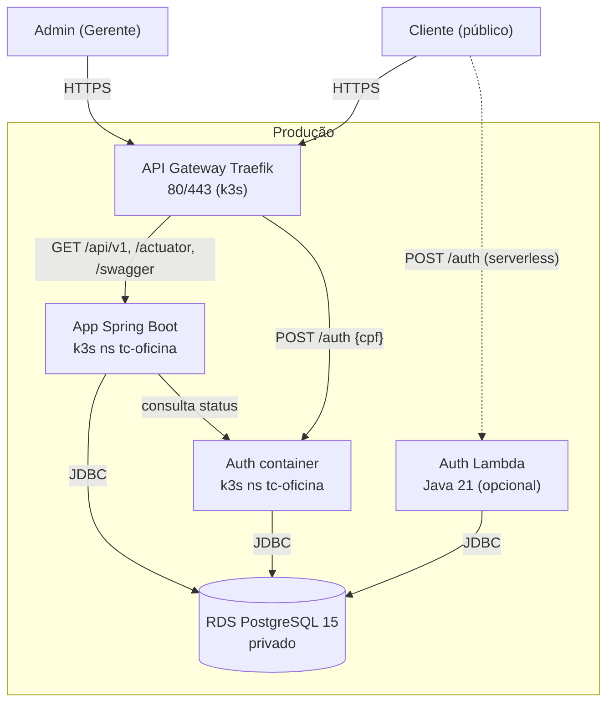
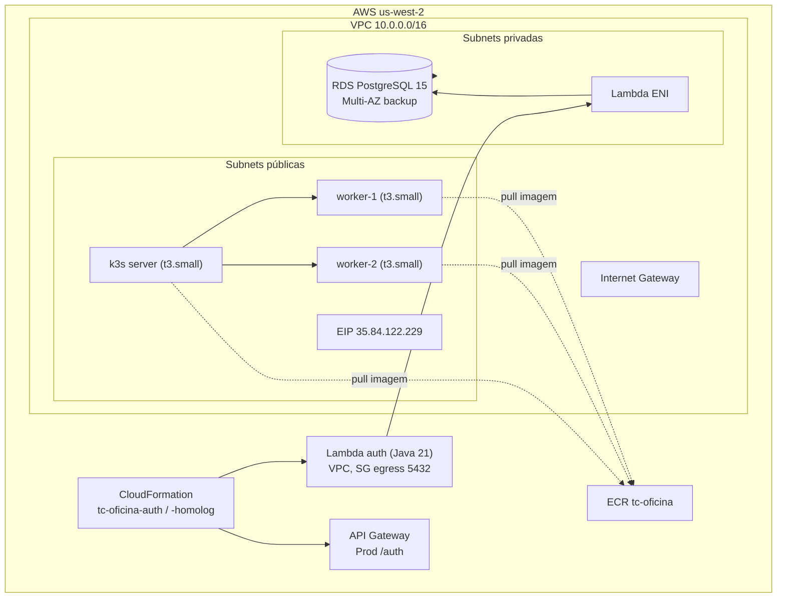
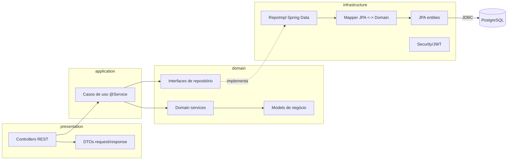
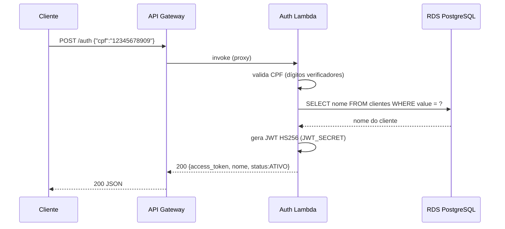
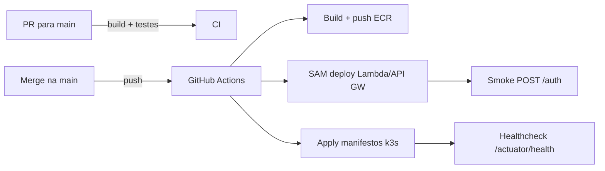

# Arquitetura de Referência

Visão de componentes e fluxos da solução **tc-oficina** (Fase 3).

## Visão de Contexto

## Visão de Deploy (AWS)

## Visão de Componentes (App Spring Boot)

## Fluxo de Autenticação (Lambda)

## Fluxo de Deploy (CI/CD)

## Endpoints em Produção

Todas as requisições passam pelo **API Gateway Traefik** (ponto único de entrada no k3s):

| Serviço | Endpoint |
|---------|----------|
| App API + Swagger | `http://35.84.122.229/swagger-ui/index.html` |
| App health | `http://35.84.122.229/actuator/health` |
| Auth (via gateway) | `http://35.84.122.229/auth` |
| Homologação (via gateway) | `http://35.84.122.229:8081/...` |
| Auth Lambda (API Gateway AWS, opcional) | `https://8rfjx5ofoi.execute-api.us-west-2.amazonaws.com/Prod/auth` |
| Auth Lambda (homolog) | `https://6116yqil7i.execute-api.us-west-2.amazonaws.com/Prod/auth` |

## Ambientes

| Ambiente | Namespace | API Gateway | Lambda stack |
|----------|-----------|-------------|--------------|
| Produção | `tc-oficina` | `:80` / `:443` | `tc-oficina-auth` |
| Homologação | `tc-oficina-homolog` | `:8081` | `tc-oficina-auth-homolog` |
