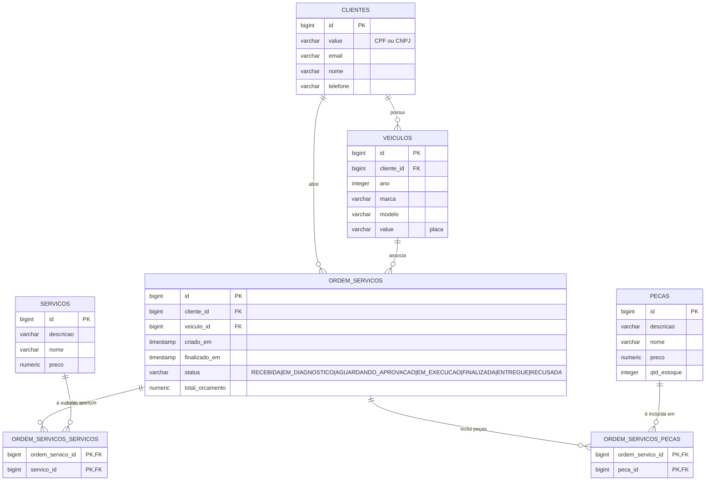

# Modelo de Dados (ERD)

Diagrama entidade-relacionamento da base **PostgreSQL 15 (RDS)**, schema `public`.

## Observações

- `clientes.value` guarda o documento sem máscara; `cliente.status` **não existe** no
  schema (a Lambda retorna `status: "ATIVO"` de forma implícita).
- O orçamento (`total_orcamento`) é **calculado** no domínio: soma dos preços de serviços
  + peças (com margem de lucro aplicada na criação da peça).
- `ordem_servicos.status` controla o ciclo de vida da OS
  (`RECEBIDA → EM_DIAGNOSTICO → AGUARDANDO_APROVACAO → EM_EXECUCAO → FINALIZADA → ENTREGUE`,
  com recusa `AGUARDANDO_APROVACAO → RECUSADA`).
- DDL gerido pelo Hibernate (`ddl-auto: update`); FKs e índices criados automaticamente.
