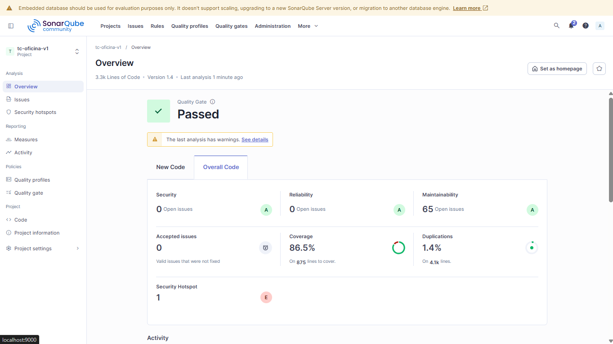
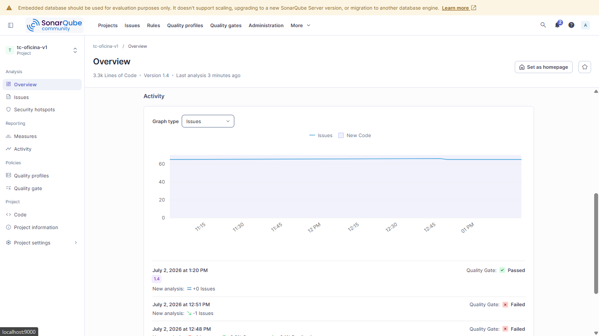
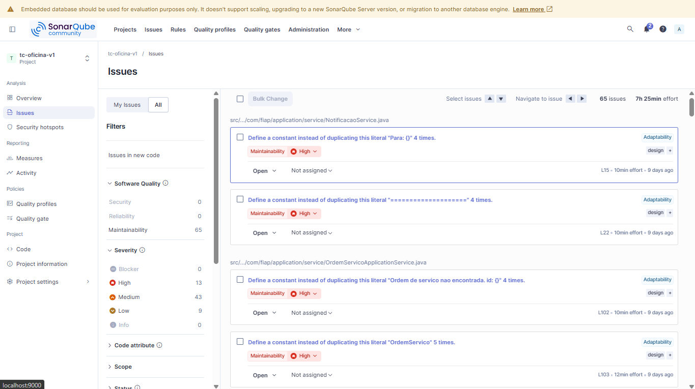
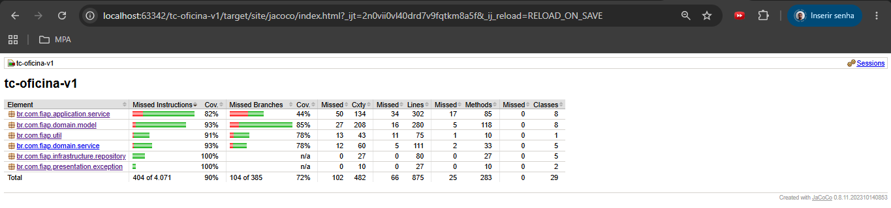

# Relatório de Vulnerabilidades - SonarQube

## Visão Geral
Foi realizada uma análise do sistema utilizando o SonarQube para identificar possíveis vulnerabilidades e problemas de qualidade no código.

**Status Geral**: 🟢 **APROVADO**

O projeto foi aprovado no Quality Gate após resolução dos itens identificados.

## Resultados da Análise

### Segurança
- **1 Security Hotspot** identificado e **CORRIGIDO**
- **Tipo**: CWE-639 — Authorization Bypass (`.anyRequest().permitAll()`)
- **Correção**: alterado para `.anyRequest().authenticated()` + CORS configurável + handlers 401/403 JSON

### Confiabilidade
- Nenhum problema encontrado

### Manutenibilidade
- 43 issues encontradas
- Principais pontos:
    - Código duplicado (strings repetidas)
    - Uso de tipos genéricos

### Cobertura de Testes
- **90.1%** (instruções) · 92.5% (linhas) · 73.0% (ramos)
- 400 testes rodando com 0 falhas

### Duplicação de Código
- 0.8% (abaixo do limite de 3%)

## Evidências

### Overview

### Overview

### Issues

### Jacoco

## Conclusão

O sistema apresenta boa qualidade geral, com **90.1% de cobertura** e **todos os 400 testes aprovados**.

O security hotspot foi corrigido com política deny-by-default e handlers adequados.  
O bug de mapeamento de domínio que impedia o fluxo de OS foi resolvido.

Os demais itens (43 code smells) são melhorias de código que não impactam segurança ou funcionalidade da aplicação.
